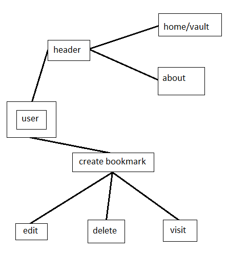
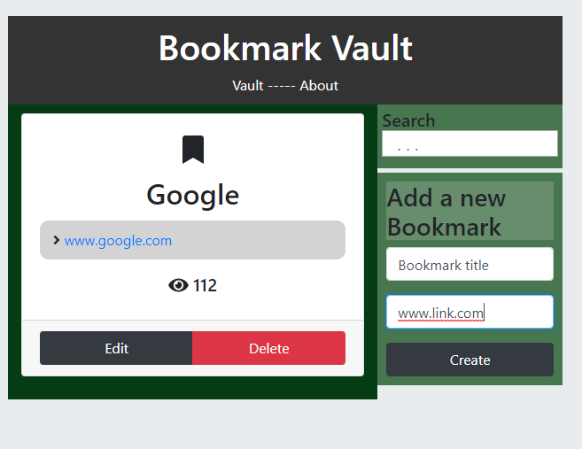
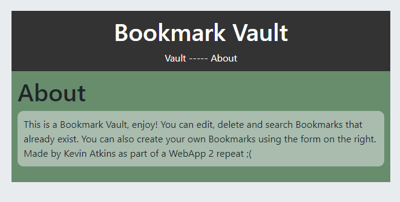
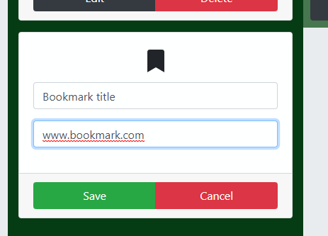
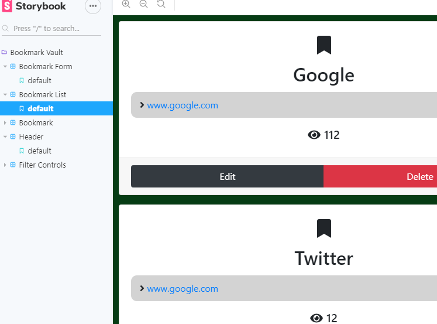

# webapp-assignment-REDO-V1 Kevin Atkins 20080734

## --------------------------Overview--------------------------
Bookmark Vault is an easy to use storage for user created Bookmarks. 
You can create, edit and delete your own Bookmarks. Bookmarks can be 
searched using the Search bar on the right side of the page. The link
of each Bookmark can be clicked and the page will increase the number
of visits a link has. The Header at the top of the page can be used to
navigate between the main page and an About page, which gives some small
information about the application.  

## --------------------------Setup--------------------------

I used the default files from the labs to get started. These were the basic 
files for both create-react-app and storybook. Npm install was then used to 
create the necessary files for further development. Additional libraries that
were needed were later installed in the same fashion.

## --------------------------Data Model Design--------------------------

## --------------------------UI Design--------------------------

MAIN PAGE

ABOUT PAGE

EDIT UI

CODE SNIPPET (App.js): 

    deleteBookmark = (id) => {
        api.delete(id); 
        this.setState({});                          
    };

    render() {
        let bookmarks = _.sortBy(api.getAll(), bookmark => -bookmark.bookmarks);
        let filteredBookmarks = bookmarks.filter(b => {
        const title = b.title;
        return title.toLowerCase().search(this.state.search.toLowerCase()) !== -1;
        });
        filteredBookmarks =
        this.state.sort === "all"
            ? filteredBookmarks
            : filteredBookmarks.filter(b => b.sort === this.state.sort);
        
        return (
        <Router>
            <Container>
            

                <Header noBookmarks={filteredBookmarks.length} />      
                <Route exact path="/" render= {props => (
                <React.Fragment>
                    <Row noGutters>
                    <Col sm={8}>
                        <BookmarkList bookmarks={filteredBookmarks} 
                        visitHandler={this.incrementVisit} deleteHandler={this.deleteBookmark} />
                    </Col>

## --------------------------Routing--------------------------

Home/Vault  -   Displays existing Bookmarks, Header, Searchbar and 
                Create Bookmark form.

About       -   Displays a simple About page for the application.

## --------------------------Storybook--------------------------

## ---------------------Independant Learning--------------------

Used React Bootstrap to style the page.Linkify was used to create the clickable 
links. Labs and online tutorials were used to implement CRUD features. 

## ----------------------------Bugs-----------------------------

Currently I know of two bugs:

    1)  Due to how the Header handles Links, Storybook is throwing an error 
        on the Header page, because the <Link> is used outside of a Router.
        If I DO put a <Router> around said link, I get an even worse bug
        where clicking the Home/About links will only change the URL, with 
        no change in the page that is being dislayed. I took the lesser of 
        two errors here but hopefully may fix it in time. As of now, the 
        Header component of Storybook is bugged but the rest is fine.

    2)  If you search for a Bookmark and then edit it while still inside the
        filter, the wrong Bookmark will be edited. Deleting while inside the
        filter still works fine.

